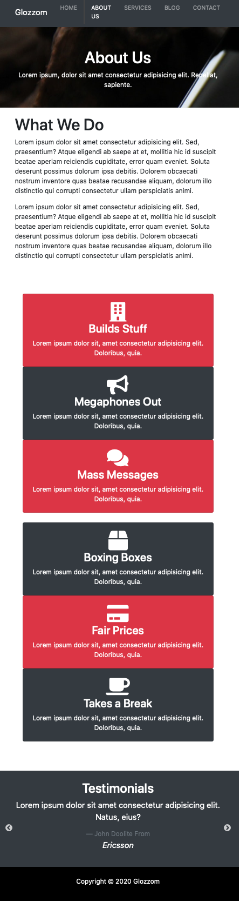
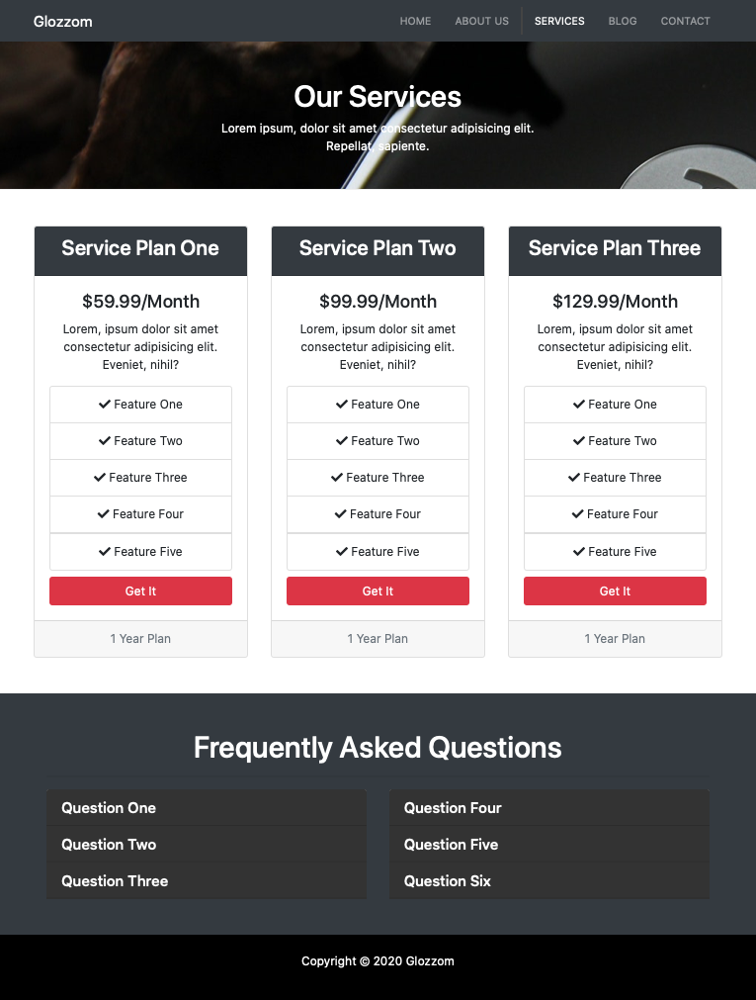
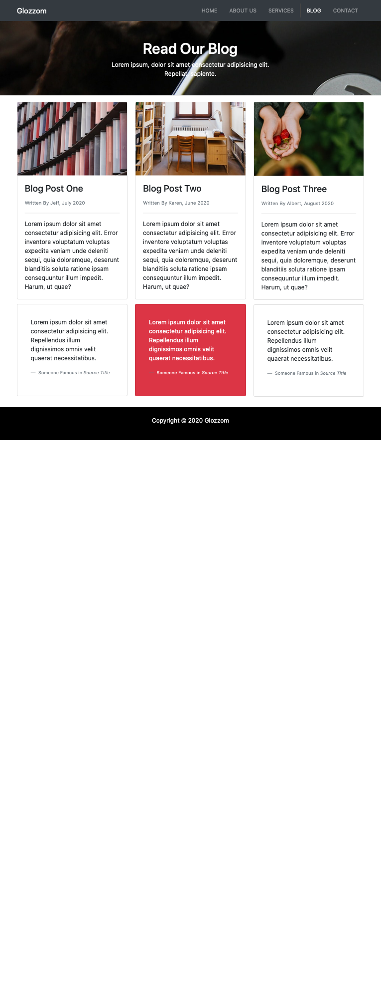
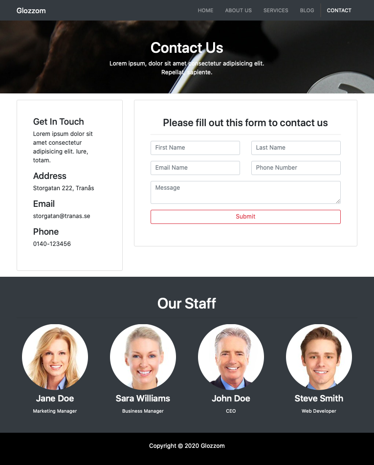

# Glozzom - Multipage company website

This user interface is built with Bootstrap.

Using ekko-lightbox for jQuery for main page image gallery
(https://ashleydw.github.io/lightbox/)

Using slick slider for about page bottom
(https://kenwheeler.github.io/slick/)

# Screenshots

Home page

About page

Services page

Blog page

Contact page

## Author

- Albert Stjärne (https://github.com/AlbertStjarne)
